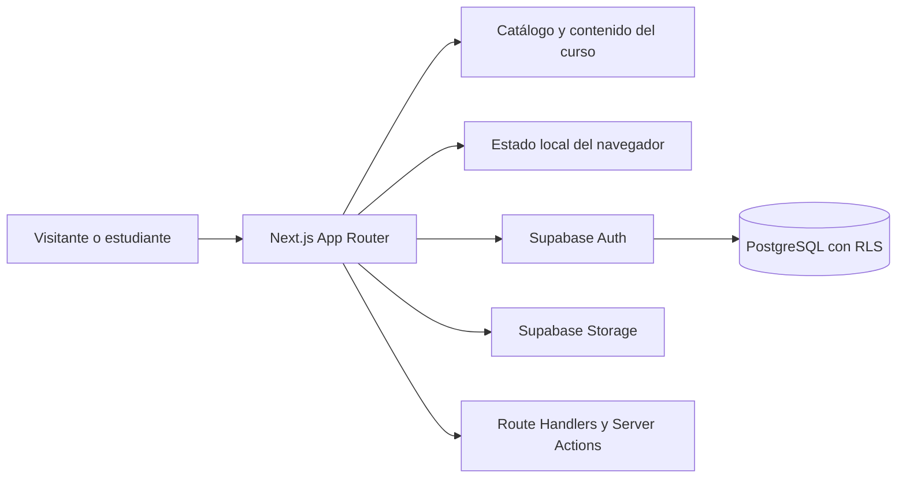

# Academia IA Educativa

Plataforma educativa gratuita en español para aprender fundamentos de inteligencia artificial, uso responsable de herramientas y AI Engineering mediante recorridos prácticos y accesibles.

[Ver demo](https://academia-ia-educativa.vercel.app) · [Ver portfolio profesional](https://portfolio-juan-sebastian.vercel.app)

## Problema

El aprendizaje de inteligencia artificial suele quedar disperso entre herramientas, tutoriales y conceptos técnicos. Esto dificulta que estudiantes y docentes construyan un recorrido ordenado, practiquen con criterio y conserven evidencia de su avance.

## Solución

Academia IA Educativa reúne contenido, actividades, evaluaciones y recursos multimedia en una aplicación web responsive. El acceso base no requiere registro: una persona puede comenzar el curso y guardar su progreso en el navegador. Las cuentas gratuitas agregan autenticación y sincronización mediante Supabase.

El repositorio contiene dos recorridos:

- **Academia IA Educativa:** 11 módulos sobre fundamentos, uso responsable, herramientas educativas y NotebookLM.
- **AI Engineering Aplicado:** 12 módulos sobre modelos, contexto, herramientas y APIs, RAG, workflows, agentes, evaluación, seguridad y producción.

## Funcionalidades verificadas

- Landing pública y catálogo de cursos.
- Módulos, lecciones, actividades, reflexión y calendario de estudio.
- Recursos diferidos: videos, audios, documentos, presentaciones e infografías se cargan bajo demanda.
- Exámenes por módulo, corrección automática y certificado PDF al alcanzar el criterio de aprobación.
- Progreso local para visitantes mediante `localStorage`.
- Registro, inicio de sesión, recuperación de contraseña y cuenta con Supabase Auth.
- Importación del progreso local a una cuenta autenticada.
- Persistencia de progreso, actividades, intentos de examen y certificados en PostgreSQL/Supabase, protegida con RLS.
- Kit gratuito de prompts entregado mediante enlace firmado; el envío por Resend es opcional.
- Diseño responsive y rutas públicas con metadatos para buscadores.

## Stack

### Frontend

- Next.js 15 con App Router
- React 19
- TypeScript
- Tailwind CSS y `@tailwindcss/typography`
- Lucide React

### Backend y datos

- Route Handlers y Server Actions de Next.js
- Supabase Auth, PostgreSQL y Storage
- `@supabase/ssr` y `@supabase/supabase-js`
- SQLite con `better-sqlite3` y Drizzle ORM para el catálogo/datos locales del proyecto
- `pdf-lib` para certificados

### Testing

- Vitest
- Testing Library
- jsdom
- ESLint

### Infraestructura y contenido

- Vercel
- Supabase Storage para multimedia optimizada en producción
- Scripts TypeScript para importar, preparar y validar contenido
- Python para generar el kit PDF de prompts

## Arquitectura



- `src/app/(marketing)`: landing, privacidad, baja y captación.
- `src/app/(app)`: dashboard, cursos, módulos, lecciones, exámenes, calendario y cuenta.
- `src/app/api`: certificados y entrega del kit.
- `src/components`: interfaz y reproductores diferidos.
- `src/lib`: catálogo, progreso, autenticación, exámenes, SEO y acceso a datos.
- `course-content/ai-engineering`: paquetes fuente y flujo de integración del curso de AI Engineering.
- `supabase/migrations`: esquema PostgreSQL, índices, políticas RLS y datos iniciales.

## Persistencia y autenticación

### Visitantes

El curso puede recorrerse sin cuenta. El navegador conserva lecciones, módulos e intentos de examen en `localStorage`; el calendario y el laboratorio de reflexión también usan almacenamiento local. Estos datos pertenecen al navegador y dispositivo donde fueron creados.

### Cuentas

Supabase Auth gestiona registro, inicio de sesión y recuperación. Una cuenta puede importar el estado local y sincronizarlo en tablas PostgreSQL con políticas de seguridad por fila. Las claves públicas se usan en el cliente; las operaciones administrativas quedan reservadas al servidor.

### Estado de la integración

La autenticación y la importación/sincronización de progreso están implementadas. La arquitectura sigue siendo **híbrida**: el acceso visitante permanece local, el catálogo conserva soporte SQLite y la entrega de multimedia se está separando del repositorio mediante Supabase Storage. No se presenta como una migración total a backend remoto.

## AI Engineering Aplicado

El segundo curso está integrado al catálogo y a las rutas públicas con el slug `ai-engineering-aplicado`. Sus 12 módulos se preparan desde manifiestos y paquetes de contenido. Los scripts de gestión permiten validar, preparar e integrar un módulo; `predev`, `prebuild`, `prelint` y `pretest` regeneran la salida necesaria antes de cada proceso.

Comandos específicos:

```powershell
npm run content:validate:ai-engineering-module -- <ruta-del-modulo>
npm run content:prepare:ai-engineering-module -- <ruta-del-modulo>
npm run content:integrate:ai-engineering-module -- <ruta-del-modulo>
npm run content:prepare:ai-engineering
```

## Testing y calidad

La suite cubre, entre otros aspectos, catálogo y rutas de AI Engineering, evaluaciones, estado local, autenticación, retorno seguro después del login, importación a Supabase, certificados, marketing y SEO.

```powershell
npm test
npm run lint
npm run build
```

## SEO y producción

- Metadatos, canonical y datos estructurados del curso.
- `sitemap.xml` y `robots.txt` generados por Next.js.
- Archivo de verificación de Google incluido en `public/`.
- URL canónica configurable con `NEXT_PUBLIC_APP_URL`.
- Despliegue público en Vercel.
- Rewrites de multimedia optimizada hacia Supabase Storage con caché inmutable.

El repositorio contiene la preparación técnica para Search Console; la indexación y el posicionamiento dependen también de la configuración y seguimiento del sitio publicado.

## Seguridad

- No subir `.env`, `.env.local`, bases SQLite ni credenciales.
- Nunca exponer `SUPABASE_SERVICE_ROLE_KEY` con el prefijo `NEXT_PUBLIC_`.
- Mantener secretos de marketing y Resend exclusivamente en el servidor.
- Conservar las políticas RLS al modificar el esquema de Supabase.
- El kit se entrega con token firmado y no como archivo público directo.

## Decisiones técnicas

- **Next.js App Router:** reúne páginas públicas, aplicación y endpoints en un mismo proyecto tipado.
- **Acceso sin registro:** reduce la barrera de entrada y mantiene disponible el contenido educativo.
- **Progreso híbrido:** `localStorage` permite comenzar de inmediato; Supabase agrega continuidad entre sesiones para cuentas.
- **RLS en PostgreSQL:** limita la lectura y escritura de cada estudiante a sus propios datos.
- **Multimedia diferida:** evita montar recursos pesados hasta que la persona decide abrirlos.
- **Contenido basado en manifiestos:** hace verificable y repetible la incorporación de módulos de AI Engineering.

## Aprendizajes

Este proyecto permitió trabajar la evolución de un producto educativo desde una experiencia local hacia una arquitectura híbrida, además de practicar modelado de progreso, autenticación, control de acceso, generación de PDFs, pruebas automatizadas y entrega eficiente de contenido pesado.

## Estado actual

| Área | Estado |
| --- | --- |
| Plataforma y cursos | En producción |
| Acceso libre y progreso local | Terminado |
| Autenticación y sincronización con Supabase | Implementado |
| AI Engineering Aplicado, módulos 1–12 | Integrado |
| Separación de multimedia hacia Storage | En transición |
| Seguimiento de indexación en Search Console | Operativo fuera del código; requiere monitoreo |

No hay capturas de interfaz actuales dentro del repositorio. Se evita mostrar imágenes de contenido como si fueran capturas del producto.

## Desarrollo local

### Requisitos

- Node.js 20.9 o superior
- npm

### Instalación

```powershell
git clone https://github.com/juansebag31-blip/academia-ia-educativa.git
Set-Location academia-ia-educativa
npm install
Copy-Item .env.example .env.local
npm run dev
```

Abrir [http://localhost:3000](http://localhost:3000).

Sin variables de Supabase, las funciones remotas no estarán disponibles, pero el proyecto conserva el recorrido local previsto para visitantes.

### Variables de entorno

Los nombres y su alcance están documentados en [`.env.example`](.env.example):

- públicas: `NEXT_PUBLIC_SUPABASE_URL`, `NEXT_PUBLIC_SUPABASE_PUBLISHABLE_KEY`, `NEXT_PUBLIC_APP_URL`, `NEXT_PUBLIC_CONTACT_EMAIL`;
- privadas: `SUPABASE_SERVICE_ROLE_KEY`, `MARKETING_HASH_SECRET`, `MARKETING_DOWNLOAD_SECRET`, `RESEND_API_KEY`, `RESEND_FROM_EMAIL`.

### Scripts útiles

```powershell
npm run dev
npm run build
npm run lint
npm test
npm run db:seed
npm run content:import
npm run kit:generate
```

Las especificaciones y planes técnicos se conservan en `docs/superpowers/`.
